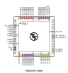
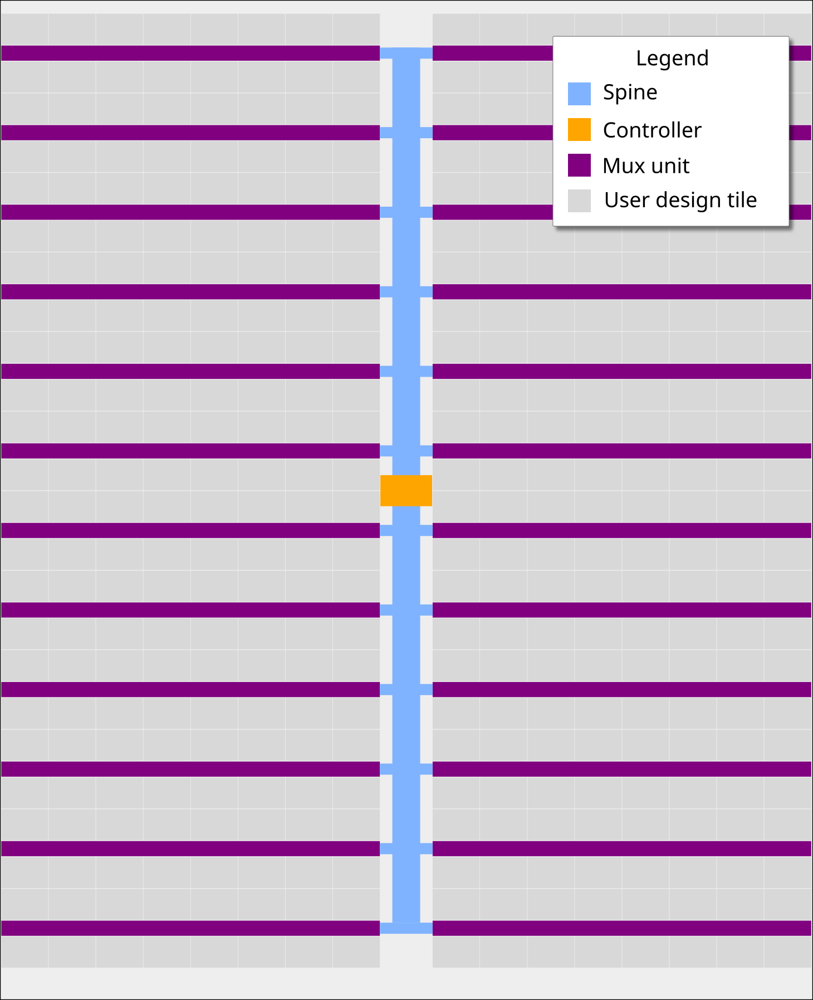
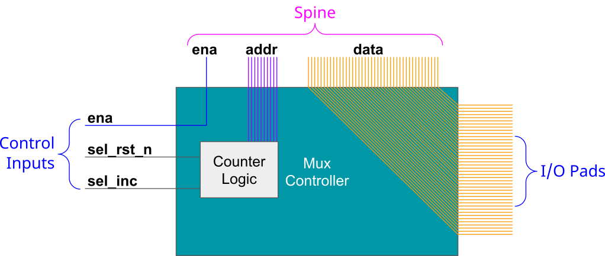
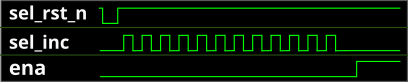

```{=latex}
\pagebreak
```
# Chip map

{width=12cm}

```{=latex}
\pagebreak
```

{width=12cm}

```{=latex}
\pagebreak
```

{width=12cm}

```{=latex}
\pagebreak
```

# Projects
## Chip ROM [0]

* Author: Uri Shaked
* Description: ROM with information about the chip
* [GitHub repository](https://github.com/TinyTapeout/tt-chip-rom)
* HDL project
* Mux address: 0
* [Extra docs]()
* Clock: 0 Hz

### How it works

ROM memory that contains information about the Tiny Tapeout chip. The ROM is 8-bit wide and 256 bytes long.

#### The ROM layout

The ROM layout is as follows:

| Address | Length | Encoding  | Description                              |
| ------- | ------ | --------- | ---------------------------------------- |
| 0       | 8      | 7-segment | Shuttle name (e.g. "tt07"), null-padded  |
| 8       | 8      | 7-segment | Git commit hash                          |
| 32      | 96     | ASCII     | Chip descriptor (see below)              |
| 248     | 4      | binary    | Magic value: `"TT\xFA\xBB"`              |
| 252     | 4      | binary    | CRC32 of the ROM contents, little-endian |

#### The chip descriptor

The chip descriptor is a simple null-terminated string that describes the chip.
Each line is a key-value pair, separated by an equals sign. It contains the following keys:

| Key     | Description                   | Example value              |
| ------- | ----------------------------- | -------------------------- |
| shuttle | The identifier of the shuttle | tt07                       |
| repo    | The name of the repository    | TinyTapeout/tinytapeout-07 |
| commit  | The commit hash *            | a1b2c3d4                   |

* The commit hash is only included for Tiny Tapeout 5 and later.

Here is a complete example of a chip descriptor:

```
shuttle=tt07
repo=TinyTapeout/tinytapeout-07
commit=a1b2c3d4
```

#### How the ROM is generated

The ROM is automatically generated by [tt-support-tools](https://github.com/TinyTapeout/tt-support-tools)
while building the final GDS file of the chip. Look at the `rom.py` file in the repository for more details.

#### Reading the ROM

There are two ways to address ROM, depending on the value of the `rst_n` pin:

1. When `rst_n` is high: Set the `ui_in` pins to the desired address.
2. When `rst_n` is low: Toggle the `clk` pin to read the ROM contents sequentially, starting from address 0.

In both cases, the ROM data for the selected address will be available on the `uo_out` pins, one byte at a time.

### How to test

The first 16 bytes of the ROM are 7-segment encoded and contain the shuttle name and commit hash. You can dump them by holding `rst_n` low and toggling the `clk` pin, and observing the on-board 7-segment display.

Alternatively, you can keep `rst_n` high and set the `ui_in` pins to the desired address using the first four on-board DIP switches, while observing the on-board 7-segment display.


### Pinout

| #             | Input    | Output   | Bidirectional   |
| ------------- | -------- | -------- | --------------- |
| 0 | addr[0]  | data[0]  |         |
| 1 | addr[1]  | data[1]  |         |
| 2 | addr[2]  | data[2]  |         |
| 3 | addr[3]  | data[3]  |         |
| 4 | addr[4]  | data[4]  |         |
| 5 | addr[5]  | data[5]  |         |
| 6 | addr[6]  | data[6]  |         |
| 7 | addr[7]  | data[7]  |         |


```{=latex}
\clearpage
```
## Tiny Tapeout Factory Test [1]

* Author: Tiny Tapeout
* Description: Factory test module
* [GitHub repository](https://github.com/TinyTapeout/ttsky25b-factory-test)
* HDL project
* Mux address: 1
* [Extra docs]()
* Clock: 0 Hz

<!---

This file is used to generate your project datasheet. Please fill in the information below and delete any unused
sections.

You can also include images in this folder and reference them in the markdown. Each image must be less than
512 kb in size, and the combined size of all images must be less than 1 MB.
-->


### How it works

The factory test module is a simple module that can be used to test all the I/O pins of the ASIC.

It has three modes of operation:

1. Mirroring the input pins to the output pins (when `rst_n` is low).
2. Mirroring the bidirectional pins to the output pins (when `rst_n` is high `sel` is low).
3. Outputing a counter on the output pins and the bidirectional pins (when `rst_n` is high and `sel` is high).

The following table summarizes the modes:

| `rst_n` | `sel` | Mode                 | uo_out value | uio pins |
|---------|-------|----------------------|--------------|----------|
| 0       | X     | Input mirror         | ui_in        | High-Z   |
| 1       | 0     | Bidirectional mirror | uio_in       | High-Z   |
| 1       | 1     | Counter              | counter      | counter  |

The counter is an 8-bit counter that increments on every clock cycle, and resets when `rst_n` is low.

### How to test

1. Set `rst_n` low and observe that the input pins (`ui_in`) are output on the output pins (`uo_out`).
2. Set `rst_n` high and `sel` low and observe that the bidirectional pins (`uio_in`) are output on the output pins (`uo_out`).
3. Set `sel` high and observe that the counter is output on both the output pins (`uo_out`) and the bidirectional pins (`uio`).


### Pinout

| #             | Input    | Output   | Bidirectional   |
| ------------- | -------- | -------- | --------------- |
| 0 | sel / in_a[0]  | output[0] / counter[0]  | in_b[0] / counter[0]        |
| 1 | in_a[1]  | output[1] / counter[1]  | in_b[1] / counter[1]        |
| 2 | in_a[2]  | output[2] / counter[2]  | in_b[2] / counter[2]        |
| 3 | in_a[3]  | output[3] / counter[3]  | in_b[3] / counter[3]        |
| 4 | in_a[4]  | output[4] / counter[4]  | in_b[4] / counter[4]        |
| 5 | in_a[5]  | output[5] / counter[5]  | in_b[5] / counter[5]        |
| 6 | in_a[6]  | output[6] / counter[6]  | in_b[6] / counter[6]        |
| 7 | in_a[7]  | output[7] / counter[7]  | in_b[7] / counter[7]        |


```{=latex}
\clearpage
```
## Four bit synchronous up counter [526]

* Author: Andrew Dieu
* Description: counts from 0 to 15 (0000-1111) in sequence, incrementing by one on each clock pulse.
* [GitHub repository](https://github.com/computersandrew/Class-24-Activity-IC-Design-Submission.git)
* [Wokwi](https://wokwi.com/projects/447383630811531265) project
* Mux address: 526
* [Extra docs]()
* Clock: 1 Hz

<!---

This file is used to generate your project datasheet. Please fill in the information below and delete any unused
sections.

You can also include images in this folder and reference them in the markdown. Each image must be less than
512 kb in size, and the combined size of all images must be less than 1 MB.
-->


### How it works

This is a 4-bit synchronous 'up' counter.

### How to test

Iterate through stepping using a button.

### External hardware

4 LEDs


### Pinout

| #             | Input    | Output   | Bidirectional   |
| ------------- | -------- | -------- | --------------- |
| 0 | CLK  | B0  |         |
| 1 |   | B1  |         |
| 2 |   | B2  |         |
| 3 |   | B3  |         |
| 4 |   |   |         |
| 5 |   |   |         |
| 6 |   |   |         |
| 7 |   |   |         |


```{=latex}
\clearpage
```
## 2 bit adder [769]

* Author: Tommy Barker
* Description: adds 2 bits
* [GitHub repository](https://github.com/tommybarker2/Wokwi-Template)
* [Wokwi](https://wokwi.com/projects/447933463901882369) project
* Mux address: 769
* [Extra docs]()
* Clock: 0 Hz

<!---

This file is used to generate your project datasheet. Please fill in the information below and delete any unused
sections.

You can also include images in this folder and reference them in the markdown. Each image must be less than
512 kb in size, and the combined size of all images must be less than 1 MB.
-->


### How it works

Adds two bit numbers and produces a 3 bit output

### How to test

Flip random inputs

### External hardware

LEDs


### Pinout

| #             | Input    | Output   | Bidirectional   |
| ------------- | -------- | -------- | --------------- |
| 0 | a0  | s0  |         |
| 1 | a1  | s1  |         |
| 2 | b0  | s2  |         |
| 3 | b1  |   |         |
| 4 |   |   |         |
| 5 |   |   |         |
| 6 |   |   |         |
| 7 |   |   |         |


```{=latex}
\clearpage
```
## 2-bit full adder [771]

* Author: Cade Collingwood
* Description: A working 2-bit full adder with carry-in and carry-out in Tiny Tapeout
* [GitHub repository](https://github.com/orbitle/ECSE1010-Class-24-Activity)
* [Wokwi](https://wokwi.com/projects/446983511627671553) project
* Mux address: 771
* [Extra docs]()
* Clock: 0 Hz

<!---

This file is used to generate your project datasheet. Please fill in the information below and delete any unused
sections.

You can also include images in this folder and reference them in the markdown. Each image must be less than
512 kb in size, and the combined size of all images must be less than 1 MB.
-->


### How it works

This project is a two-bit full adder in the form of a combinational logic circuit. The circuit takes five inputs: the digits of two two-bit binary numbers and a carry-in input. The circuit outputs the two-bit result of adding the two numbers and a carry-out output.

### How to test

A1 and A2 are the digits of the first number. B1 and B2 are the digits of the second number. C-in is carry-in. C1 and C2 are the digits of the result of adding A and B. C-out is the carry-out (activates if there is overflow from addition).

### External hardware

List external hardware used in your project (e.g. PMOD, LED display, etc), if any


### Pinout

| #             | Input    | Output   | Bidirectional   |
| ------------- | -------- | -------- | --------------- |
| 0 | A1  | C1  |         |
| 1 | B1  | C2  |         |
| 2 |   |   |         |
| 3 | A2  |   |         |
| 4 | B2  |   |         |
| 5 |   |   |         |
| 6 |   |   |         |
| 7 | C-in  | C-out  |         |


```{=latex}
\clearpage
```
## 4 Bit adder [773]

* Author: Nicholas Gladu, Jun Iguchi
* Description: 2-bit full adder
* [GitHub repository](https://github.com/nick-gl/Lab_4A_adder)
* [Wokwi](https://wokwi.com/projects/447830736860122113) project
* Mux address: 773
* [Extra docs]()
* Clock: 0 Hz

<!---

This file is used to generate your project datasheet. Please fill in the information below and delete any unused
sections.

You can also include images in this folder and reference them in the markdown. Each image must be less than
512 kb in size, and the combined size of all images must be less than 1 MB.
-->


### How it works

It works by taking 5 inputs and outputing the answer for a 2-bit full adder.

### How to test

try every combination of the 5 buttons.

### External hardware

Uses Led's and 5 switches.


### Pinout

| #             | Input    | Output   | Bidirectional   |
| ------------- | -------- | -------- | --------------- |
| 0 | a0  | x0  |         |
| 1 | b0  | x1  |         |
| 2 | c-in  | c-out  |         |
| 3 | a1  |   |         |
| 4 | b1  |   |         |
| 5 |   |   |         |
| 6 |   |   |         |
| 7 |   |   |         |


```{=latex}
\clearpage
```
## 2-bit full adder circuit simulation [775]

* Author: Melissa DeLuise
* Description: 2-bit full adder adds two binary numbers and produces two sum bits and a carry bit.
* [GitHub repository](https://github.com/melissagdeluise-png/ecse-2bit-full-adder-circuit.git)
* [Wokwi](https://wokwi.com/projects/446987090831206401) project
* Mux address: 775
* [Extra docs]()
* Clock: 0 Hz

<!---

This file is used to generate your project datasheet. Please fill in the information below and delete any unused
sections.

You can also include images in this folder and reference them in the markdown. Each image must be less than
512 kb in size, and the combined size of all images must be less than 1 MB.
-->


### How it works

A 2-bit full adder circuit adds two 2-bit binary numbers, producing a 2-bit sum and a carry-out bit. It is constructed by connecting two 1-bit adders in series.

### How to test

Test using different inputs.

### External hardware

LED display


### Pinout

| #             | Input    | Output   | Bidirectional   |
| ------------- | -------- | -------- | --------------- |
| 0 | a0  | s0  |         |
| 1 | b0  | s1  |         |
| 2 | a1  | c  |         |
| 3 | b1  |   |         |
| 4 |   |   |         |
| 5 |   |   |         |
| 6 |   |   |         |
| 7 |   |   |         |


```{=latex}
\clearpage
```
## ECSE 1010 4-bit synchronous counter [777]

* Author: Joseph Petrarca
* Description: Counts from 0-15 in BCD either using external clock signal, active high enable
* [GitHub repository](https://github.com/jpetrarca4/ECSE-1010-IC-Design)
* [Wokwi](https://wokwi.com/projects/447989872513811457) project
* Mux address: 777
* [Extra docs]()
* Clock: 1 Hz

<!---

This file is used to generate your project datasheet. Please fill in the information below and delete any unused
sections.

You can also include images in this folder and reference them in the markdown. Each image must be less than
512 kb in size, and the combined size of all images must be less than 1 MB.
-->


### How it works

This circuit counts in BCD from 0-15 using an external clock signal. It has an active high enable and reset functionality. D represents the MSB while A represents the LSB.

### How to test

Ensure that the enable is high, provide a clock signal at an observable frequency. Connect the outputs to LEDs or some other method of monitoring their volatage. Watch as the counter circuit cycles from 0-15 in BCD.

### External hardware

Oscilator, LEDs, switch


### Pinout

| #             | Input    | Output   | Bidirectional   |
| ------------- | -------- | -------- | --------------- |
| 0 | EN  | A  |         |
| 1 |   | B  |         |
| 2 |   | C  |         |
| 3 |   | D  |         |
| 4 |   |   |         |
| 5 |   |   |         |
| 6 |   |   |         |
| 7 |   |   |         |


```{=latex}
\clearpage
```
## 2-bit full adder [779]

* Author: Jack Notaro and Simarit Seera
* Description: This circuit does exactly as its name says, it is able to add two 2-bit numbers together. It has 3 LEDs, one that is sum 0, one that is sum 1, and one that represents the carry. This can compute a maximum binary value of 110, or 10 with 1 as a carry.
* [GitHub repository](https://github.com/jacknotaro7/JackNotaro)
* [Wokwi](https://wokwi.com/projects/446992592396712961) project
* Mux address: 779
* [Extra docs]()
* Clock: 0 Hz

<!---

This file is used to generate your project datasheet. Please fill in the information below and delete any unused
sections.

You can also include images in this folder and reference them in the markdown. Each image must be less than
512 kb in size, and the combined size of all images must be less than 1 MB.
-->


### How it works

Combination of gates allow for 2 2-bit numbers to be added together, with the answer represented by LEDs to indicate 1 (on) or 0 (off) for the sum of the first digit, sum of the second digit, and the carry.

### How to test

Click play and turn on the switches to modify the numbers added and see the final result.

### External hardware

None


### Pinout

| #             | Input    | Output   | Bidirectional   |
| ------------- | -------- | -------- | --------------- |
| 0 | IN0  | OUT0  |         |
| 1 | IN1  | OUT1  |         |
| 2 | IN2  | OUT2  |         |
| 3 | IN3  | OUT3  |         |
| 4 |   |   |         |
| 5 |   |   |         |
| 6 |   |   |         |
| 7 |   |   |         |


```{=latex}
\clearpage
```
## D LATCH [781]

* Author: Jeain Kim
* Description: demonstrates a working D Latch
* [GitHub repository](https://github.com/jeaink0607/lab4b)
* [Wokwi](https://wokwi.com/projects/447911024130222081) project
* Mux address: 781
* [Extra docs]()
* Clock: 0 Hz

<!---

This file is used to generate your project datasheet. Please fill in the information below and delete any unused
sections.

You can also include images in this folder and reference them in the markdown. Each image must be less than
512 kb in size, and the combined size of all images must be less than 1 MB.
-->


### How it works

A single button changes the lights of A and B depending on the D Latch

### How to test

Press button multiple times to see the different outputs it produces

### External hardware

LED lights


### Pinout

| #             | Input    | Output   | Bidirectional   |
| ------------- | -------- | -------- | --------------- |
| 0 |   | light A  |         |
| 1 |   | light B  |         |
| 2 |   |   |         |
| 3 |   |   |         |
| 4 |   |   |         |
| 5 |   |   |         |
| 6 |   |   |         |
| 7 |   |   |         |


```{=latex}
\clearpage
```
## 4-to-1 multiplexer [782]

* Author: Angela R.
* Description: combination logic of 4-to-1 multiplexer
* [GitHub repository](https://github.com/Roba250/Intro-to-ECSE-3)
* [Wokwi](https://wokwi.com/projects/447173649954615297) project
* Mux address: 782
* [Extra docs]()
* Clock: 0 Hz

<!---

This file is used to generate your project datasheet. Please fill in the information below and delete any unused
sections.

You can also include images in this folder and reference them in the markdown. Each image must be less than
512 kb in size, and the combined size of all images must be less than 1 MB.
-->


### How it works

uses logice gate to create a 4-to-1 multiplexer

### How to test

fliping switches

### External hardware

List external hardware used in your project (e.g. PMOD, LED display, etc), if any


### Pinout

| #             | Input    | Output   | Bidirectional   |
| ------------- | -------- | -------- | --------------- |
| 0 | 1  | 11  |         |
| 1 | 2  |   |         |
| 2 | 3  |   |         |
| 3 | 4  |   |         |
| 4 | 5  |   |         |
| 5 | 6  |   |         |
| 6 |   |   |         |
| 7 |   |   |         |


```{=latex}
\clearpage
```
## Intro to ECSE IC [783]

* Author: Daniel Zaninovic
* Description: ring counter
* [GitHub repository](https://github.com/Rodyker/intro-to-ecse-IC)
* [Wokwi](https://wokwi.com/projects/447187389911513089) project
* Mux address: 783
* [Extra docs]()
* Clock: 0 Hz

<!---

This file is used to generate your project datasheet. Please fill in the information below and delete any unused
sections.

You can also include images in this folder and reference them in the markdown. Each image must be less than
512 kb in size, and the combined size of all images must be less than 1 MB.
-->


### How it works

Chained D flip flops

### How to test

Cycle through all states

### External hardware

Four LEDs


### Pinout

| #             | Input    | Output   | Bidirectional   |
| ------------- | -------- | -------- | --------------- |
| 0 | Cycle  | LED1  |         |
| 1 | RST  | LED2  |         |
| 2 |   | LED3  |         |
| 3 |   | LED4  |         |
| 4 |   |   |         |
| 5 |   |   |         |
| 6 |   |   |         |
| 7 |   |   |         |


```{=latex}
\clearpage
```
## Lab 4A 2-bit Adder [833]

* Author: Xander St. Cyr
* Description: A full 2-bit adder with a carry bit.
* [GitHub repository](https://github.com/Xandrosy/IC-Design)
* [Wokwi](https://wokwi.com/projects/446715442694161409) project
* Mux address: 833
* [Extra docs]()
* Clock: 0 Hz

<!---

This file is used to generate your project datasheet. Please fill in the information below and delete any unused
sections.

You can also include images in this folder and reference them in the markdown. Each image must be less than
512 kb in size, and the combined size of all images must be less than 1 MB.
-->


### How it works

Takes up to 5 inputs (2 ones bits, 2 two bits, and a carry one bit) and outputs the addition of all inputs.

### How to test

A1 **xor** B1 should set the middle light to high  
A1 **and** B1 should set the furthest right light to high  
A1 **xor** B1 **and** A0 **and** B0 should set the furthest right light to high  
A0 **xor** B0 should set the furthest left light to high  
A0 **and** B0 **xor** (A1 **or** B1) should set the middle light to high  
The carry bit acts as an additional input of value A0 or B0  
When all bits are active, all lights should be on

### External hardware

LEDs and a variable power source, such as a button.


### Pinout

| #             | Input    | Output   | Bidirectional   |
| ------------- | -------- | -------- | --------------- |
| 0 | Input A0  |   |         |
| 1 | Input B0  |   |         |
| 2 | Input A1  |   |         |
| 3 | Input B1  |   |         |
| 4 | Carry Bit  |   |         |
| 5 |   |   |         |
| 6 |   |   |         |
| 7 |   |   |         |


```{=latex}
\clearpage
```
## 4 Bit Up Counter Synchronous [835]

* Author: Riya Jain, Alex Htutt, Emily Lin
* Description: 4 Bit Up Counter Schematic using one LED as a counter, and the other as a display.
* [GitHub repository](https://github.com/elin20-hub/lab4b)
* [Wokwi](https://wokwi.com/projects/447983687789484033) project
* Mux address: 835
* [Extra docs]()
* Clock: 0 Hz

<!---

This file is used to generate your project datasheet. Please fill in the information below and delete any unused
sections.

You can also include images in this folder and reference them in the markdown. Each image must be less than
512 kb in size, and the combined size of all images must be less than 1 MB.
-->


### How it works

Using two LEDs and a clock signal, stimulating the step button four times will cause one of the LEDs to turn on and off continuously (as long as the clock signal keeps running). While the step button is being pushed, the other LED will keep flashing as a counter signal.

### How to test

Use the step button as a clock signal and count four presses, and ensure that one of the LEDs turns on and off after each set of four counter signals.

### External hardware

List external hardware used in your project (e.g. PMOD, LED display, etc), if any


### Pinout

| #             | Input    | Output   | Bidirectional   |
| ------------- | -------- | -------- | --------------- |
| 0 | CLK  | red LED  |         |
| 1 | IN0  | blue LED  |         |
| 2 |   |   |         |
| 3 |   |   |         |
| 4 |   |   |         |
| 5 |   |   |         |
| 6 |   |   |         |
| 7 |   |   |         |


```{=latex}
\clearpage
```
## 4-bit-synchronous-up-counter-using-T-flip-flop-ICs [837]

* Author: Lee &amp; Nick
* Description: 4 bit synchronous up counter
* [GitHub repository](https://github.com/LeeASC10679/4-bit-synchronous-up-counter-using-T-flip-flop-ICs-)
* [Wokwi](https://wokwi.com/projects/447644378544688129) project
* Mux address: 837
* [Extra docs]()
* Clock: 10000 Hz

<!---

This file is used to generate your project datasheet. Please fill in the information below and delete any unused
sections.

You can also include images in this folder and reference them in the markdown. Each image must be less than
512 kb in size, and the combined size of all images must be less than 1 MB.
-->


### How it works

bit sync counter

### How to test

supply power, look at led, check with truth table

### External hardware

LED


### Pinout

| #             | Input    | Output   | Bidirectional   |
| ------------- | -------- | -------- | --------------- |
| 0 | CLK  | A  |         |
| 1 |   | B  |         |
| 2 |   | C  |         |
| 3 |   | D  |         |
| 4 |   |   |         |
| 5 |   |   |         |
| 6 |   |   |         |
| 7 |   |   |         |


```{=latex}
\clearpage
```
## 2 bit Full adder [839]

* Author: Aiden Atri
* Description: 2 bit full adder
* [GitHub repository](https://github.com/aidenatri-png/ecse-chip)
* [Wokwi](https://wokwi.com/projects/447895555211453441) project
* Mux address: 839
* [Extra docs]()
* Clock: 0 Hz

<!---

This file is used to generate your project datasheet. Please fill in the information below and delete any unused
sections.

You can also include images in this folder and reference them in the markdown. Each image must be less than
512 kb in size, and the combined size of all images must be less than 1 MB.
-->


### How it works

It adds 2 two-bit binary values using 2 combined one-bit adders chained together.

### How to test

Use the truth table and make sure the outputs are accurate with the inputs

### External hardware

List external hardware used in your project (e.g. PMOD, LED display, etc), if any


### Pinout

| #             | Input    | Output   | Bidirectional   |
| ------------- | -------- | -------- | --------------- |
| 0 | a1  | s0  |         |
| 1 | b1  | s1  |         |
| 2 | cin  | cout  |         |
| 3 | a2  |   |         |
| 4 | b2  |   |         |
| 5 |   |   |         |
| 6 |   |   |         |
| 7 |   |   |         |


```{=latex}
\clearpage
```
## Intro-to-ECSE---Lab4B---JK-Flip-Flop [841]

* Author: Michael Ohene-Ologo
* Description: Circuit Diagram of JK-Flip-Flop
* [GitHub repository](https://github.com/ohenem/Intro-to-ECSE---Lab-4B---JK-Flip-Flop-Circuit-1-)
* [Wokwi](https://wokwi.com/projects/447358337716034561) project
* Mux address: 841
* [Extra docs]()
* Clock: 0 Hz

<!---

This file is used to generate your project datasheet. Please fill in the information below and delete any unused
sections.

You can also include images in this folder and reference them in the markdown. Each image must be less than
512 kb in size, and the combined size of all images must be less than 1 MB.
-->


### How it works

It "sets" to 1 if J is high and K is low, "resets" to 0 if K is high and J is low, holds its state if both are low, and "toggles" (flips its current state) if both J and K are high.

### How to test

Connect the J, K, and Clock inputs to appropriate signals and observe the Q and Q̅ outputs to verify the expected behavior for each input combination

### External hardware

2 LED


### Pinout

| #             | Input    | Output   | Bidirectional   |
| ------------- | -------- | -------- | --------------- |
| 0 | J  | Q  |         |
| 1 | K  | !Q  |         |
| 2 |   |   |         |
| 3 |   |   |         |
| 4 |   |   |         |
| 5 |   |   |         |
| 6 |   |   |         |
| 7 |   |   |         |


```{=latex}
\clearpage
```
## Lab 4A [843]

* Author: Isiah
* Description: 1-bit Adder
* [GitHub repository](https://github.com/isiahgg/Isiah-Micheal-Lab-4A)
* [Wokwi](https://wokwi.com/projects/447352099694738433) project
* Mux address: 843
* [Extra docs]()
* Clock: 0 Hz

<!---

This file is used to generate your project datasheet. Please fill in the information below and delete any unused
sections.

You can also include images in this folder and reference them in the markdown. Each image must be less than
512 kb in size, and the combined size of all images must be less than 1 MB.
-->


### How it works

1 bit full adder combinational circuit adding and carrying binary numbers.

### How to test

Basically as you turn on each input it shows an output wther its 1 0 or 1 and carry

### External hardware

No external hardware used.


### Pinout

| #             | Input    | Output   | Bidirectional   |
| ------------- | -------- | -------- | --------------- |
| 0 | IN0  | OUT0  |         |
| 1 | IN1  | OU1  |         |
| 2 | IN2  |   |         |
| 3 |   |   |         |
| 4 |   |   |         |
| 5 |   |   |         |
| 6 |   |   |         |
| 7 |   |   |         |


```{=latex}
\clearpage
```
## 4 bit up counter [845]

* Author: Anik P
* Description: A 4 bit up counter with clock
* [GitHub repository](https://github.com/patela19-rpi/lab-4-up-counter)
* [Wokwi](https://wokwi.com/projects/447346482908403713) project
* Mux address: 845
* [Extra docs]()
* Clock: 10000 Hz

<!---

This file is used to generate your project datasheet. Please fill in the information below and delete any unused
sections.

You can also include images in this folder and reference them in the markdown. Each image must be less than
512 kb in size, and the combined size of all images must be less than 1 MB.
-->


### How it works

Simple 4 bit up counter that uses JK flip flops

### How to test

Can be tested by connecting the clock and seeing if the leds count up

### External hardware

4 LEDs


### Pinout

| #             | Input    | Output   | Bidirectional   |
| ------------- | -------- | -------- | --------------- |
| 0 |   | counter bit 1  |         |
| 1 |   | counter bit 2  |         |
| 2 |   | counter bit 3  |         |
| 3 |   | counter bit 4  |         |
| 4 |   |   |         |
| 5 |   |   |         |
| 6 |   |   |         |
| 7 |   |   |         |


```{=latex}
\clearpage
```
## LAB 4A DESIGN [847]

* Author: Jared Lesk
* Description: 4 bit parallel in serial out-shift register
* [GitHub repository](https://github.com/jaredlesk/ECSE-LAB-4B-Circuit-Design)
* [Wokwi](https://wokwi.com/projects/447907135027520513) project
* Mux address: 847
* [Extra docs]()
* Clock: 0 Hz

<!---

This file is used to generate your project datasheet. Please fill in the information below and delete any unused
sections.

You can also include images in this folder and reference them in the markdown. Each image must be less than
512 kb in size, and the combined size of all images must be less than 1 MB.
-->


### How it works

Manual clock. 4 Flip flops and 3 or gates. Each clock tick pushes the input to the next flip flop.

### How to test

Hit your input and tick the clock. This will pass the input to the first flip flop. Then hit the your next input and push tick the clock and all inputs will shift down one flip-flop.

### External hardware

We used LEDs to display the ticking output and display the stored input in each flip flop after each clock tick.


### Pinout

| #             | Input    | Output   | Bidirectional   |
| ------------- | -------- | -------- | --------------- |
| 0 | A1  | B1  |         |
| 1 | A2  | B2  |         |
| 2 | A3  | B3  |         |
| 3 | A4  | B4  |         |
| 4 |   |   |         |
| 5 |   |   |         |
| 6 |   |   |         |
| 7 |   |   |         |


```{=latex}
\clearpage
```
## 4 Bit Counter [896]

* Author: Roniel Peralta
* Description: LEDs turn on to simulate incrementing by 1
* [GitHub repository](https://github.com/Roniel-Peralta/4-Bit-Counter-11-14)
* [Wokwi](https://wokwi.com/projects/447358043468808193) project
* Mux address: 896
* [Extra docs]()
* Clock: 0 Hz

<!---

This file is used to generate your project datasheet. Please fill in the information below and delete any unused
sections.

You can also include images in this folder and reference them in the markdown. Each image must be less than
512 kb in size, and the combined size of all images must be less than 1 MB.
-->


### How it works

D Flip-Flops and logic gates are used to simulate the toggle function of JK Flip-Flops in order to count numbers.

### How to test

The LEDs will begin in a random state and pressing the button will increase that by 1.

### External hardware

List external hardware used in your project (e.g. PMOD, LED display, etc), if any


### Pinout

| #             | Input    | Output   | Bidirectional   |
| ------------- | -------- | -------- | --------------- |
| 0 |   | Output least significant LED  |         |
| 1 |   | Output second least significant LED  |         |
| 2 |   | Output second most significant LED  |         |
| 3 |   | Output most significant LED  |         |
| 4 |   |   |         |
| 5 |   |   |         |
| 6 |   |   |         |
| 7 |   |   |         |


```{=latex}
\clearpage
```
## 7 Segment Decoder [897]

* Author: Ethan Empaynado
* Description: Takes 4 binary inputs and outputs 7 signals, one for each segment of a 7 segment display. There is no DP.
* [GitHub repository](https://github.com/42millionpeople/ECSE-1010_Lab-4_7-Segment-Decoder)
* [Wokwi](https://wokwi.com/projects/446997400401235969) project
* Mux address: 897
* [Extra docs]()
* Clock: 0 Hz

<!---

This file is used to generate your project datasheet. Please fill in the information below and delete any unused
sections.

You can also include images in this folder and reference them in the markdown. Each image must be less than
512 kb in size, and the combined size of all images must be less than 1 MB.
-->


### How it works

For inputs that give a constant voltage from switches feed into each of the four inputs. Through logic gates, the circuit determines which segments should be on and which should be off. Segments that should be on hvae a high signal on their output line that can connect to its correspoding pin on a 7 segment display.

### How to test

Connect 4 switches into each of the inputs. Counting up from 0 to 9 in binary (using the switches where input_A is the 8 place and input_D is the 1 place in binary), the 7 segment display should display the corresponding digital number. Above 9 (10-15) the decoder 'breaks' as it shows nothing useful (some other decoders display consistent signals above 10).

### External hardware

Some 12 LEDs to show signals and a seven segment display to display the output. Resistors were used as needed to keep the voltage appropriate.


### Pinout

| #             | Input    | Output   | Bidirectional   |
| ------------- | -------- | -------- | --------------- |
| 0 | input_A  | output_A  |         |
| 1 | input_B  | output_B  |         |
| 2 | input_C  | output_C  |         |
| 3 | input_D  | output_D  |         |
| 4 |   | output_E  |         |
| 5 |   | output_F  |         |
| 6 |   | output_G  |         |
| 7 |   |   |         |


```{=latex}
\clearpage
```
## 2-bits magnitude comparator [898]

* Author: Hung Xuan (Simon) Ngo, Michael Lim, Julien Zhang
* Description: 2-bits magnitude comparator
* [GitHub repository](https://github.com/hung-xuan-ngo-savg/2-bits-magnitude-comparator)
* [Wokwi](https://wokwi.com/projects/446990787716412417) project
* Mux address: 898
* [Extra docs]()
* Clock: 0 Hz

<!---

This file is used to generate your project datasheet. Please fill in the information below and delete any unused
sections.

You can also include images in this folder and reference them in the markdown. Each image must be less than
512 kb in size, and the combined size of all images must be less than 1 MB.
-->


### How it works

Compare values of one two bits number to the other.

### How to test

Turn switch on or off to get the value you want for A,B

### External hardware

3 LEDs (RED,YELLOW,GREEN)


### Pinout

| #             | Input    | Output   | Bidirectional   |
| ------------- | -------- | -------- | --------------- |
| 0 | A1  | Yellow  |         |
| 1 | B1  | Red  |         |
| 2 | A0  | Green  |         |
| 3 | B0  |   |         |
| 4 |   |   |         |
| 5 |   |   |         |
| 6 |   |   |         |
| 7 |   |   |         |


```{=latex}
\clearpage
```
## ECSE LAB 4 [899]

* Author: David Tverskoy
* Description: 2-bit ripple adder
* [GitHub repository](https://github.com/davidtverskoy/Intro-to-ECSE-IC-design-submission)
* [Wokwi](https://wokwi.com/projects/446717164532704257) project
* Mux address: 899
* [Extra docs]()
* Clock: 0 Hz

<!---

This file is used to generate your project datasheet. Please fill in the information below and delete any unused
sections.

You can also include images in this folder and reference them in the markdown. Each image must be less than
512 kb in size, and the combined size of all images must be less than 1 MB.
-->


### How it works

This is a 2 bit adder with a carry in input

### How to test

You use the switches to put in certain values to add 2-bit numbers.

### External hardware

LED's


### Pinout

| #             | Input    | Output   | Bidirectional   |
| ------------- | -------- | -------- | --------------- |
| 0 | B0  | S0  |         |
| 1 | Cin  | S1  |         |
| 2 | A0  | S2  |         |
| 3 | A1  |   |         |
| 4 | B1  |   |         |
| 5 |   |   |         |
| 6 |   |   |         |
| 7 |   |   |         |


```{=latex}
\clearpage
```
## 4 bit ring counter [900]

* Author: Ryan Ma
* Description: Alternating ring counter
* [GitHub repository](https://github.com/ryan718585/4-bit-ring-counter)
* [Wokwi](https://wokwi.com/projects/446358765191457793) project
* Mux address: 900
* [Extra docs]()
* Clock: 0 Hz

<!---

This file is used to generate your project datasheet. Please fill in the information below and delete any unused
sections.

You can also include images in this folder and reference them in the markdown. Each image must be less than
512 kb in size, and the combined size of all images must be less than 1 MB.
-->


### How it works

4 D Flipflops stores the previous signal and transfers to next LED. Starts randomly.

### How to test

Connect CLK and check all 4 outputs.

### External hardware

List external hardware used in your project (e.g. PMOD, LED display, etc), if any


### Pinout

| #             | Input    | Output   | Bidirectional   |
| ------------- | -------- | -------- | --------------- |
| 0 |   |   | out1        |
| 1 |   |   | out2        |
| 2 |   |   | out3        |
| 3 |   |   | out4        |
| 4 |   |   |         |
| 5 |   |   |         |
| 6 |   |   |         |
| 7 |   |   |         |


```{=latex}
\clearpage
```
## 4-bit asynchronous up counter [901]

* Author: Gary Wong
* Description: up counter using D flip-flops converted to T flip-flops
* [GitHub repository](https://github.com/garywong12345/4-bit-asynchronous-up-counter.git)
* [Wokwi](https://wokwi.com/projects/447821705259994113) project
* Mux address: 901
* [Extra docs]()
* Clock: 0 Hz

<!---

This file is used to generate your project datasheet. Please fill in the information below and delete any unused
sections.

You can also include images in this folder and reference them in the markdown. Each image must be less than
512 kb in size, and the combined size of all images must be less than 1 MB.
-->


### How it works

Given an input of low from I0, the circuit counts up with each Clk input.

### How to test

Set I0 to low, then step clock forward 16 times to test all possible variations.

### External hardware

One Button, Four LEDs


### Pinout

| #             | Input    | Output   | Bidirectional   |
| ------------- | -------- | -------- | --------------- |
| 0 | Clk  | Q0  |         |
| 1 | I0  | Q1  |         |
| 2 |   | Q2  |         |
| 3 |   | Q3  |         |
| 4 |   |   |         |
| 5 |   |   |         |
| 6 |   |   |         |
| 7 |   |   |         |


```{=latex}
\clearpage
```
## Single AND Gate [902]

* Author: John
* Description: A single AND gate
* [GitHub repository](https://github.com/nhoj98/intro-to-ecse-1010-10-31-demo)
* [Wokwi](https://wokwi.com/projects/446357766648124417) project
* Mux address: 902
* [Extra docs]()
* Clock: 0 Hz

<!---

This file is used to generate your project datasheet. Please fill in the information below and delete any unused
sections.

You can also include images in this folder and reference them in the markdown. Each image must be less than
512 kb in size, and the combined size of all images must be less than 1 MB.
-->


### How it works

A single and gate.

### How to test

Try every combination of two bits.

### External hardware

A Single LED.


### Pinout

| #             | Input    | Output   | Bidirectional   |
| ------------- | -------- | -------- | --------------- |
| 0 | A  | A AND B  |         |
| 1 | B  |   |         |
| 2 |   |   |         |
| 3 |   |   |         |
| 4 |   |   |         |
| 5 |   |   |         |
| 6 |   |   |         |
| 7 |   |   |         |


```{=latex}
\clearpage
```
## 7 Segment Display Decoder [903]

* Author: Saanvi,  Kelly, Sameetha
* Description: A seven segment display decoder!
* [GitHub repository](https://github.com/webwizardsaanvi/7-segment-display)
* [Wokwi](https://wokwi.com/projects/446996314264114177) project
* Mux address: 903
* [Extra docs]()
* Clock: 0 Hz

<!---

This file is used to generate your project datasheet. Please fill in the information below and delete any unused
sections.

You can also include images in this folder and reference them in the markdown. Each image must be less than
512 kb in size, and the combined size of all images must be less than 1 MB.
-->


### How it works

Basically, it uses a bunch of inverters, and, and or gates to make a seven segment display work! :D

### How to test

The project can be tested using the first 4 inputs, with them represening an ABCD input, which would translate to a 4 bit binary output, that when converted ot a decimal value, would be the value displayed on the seven segment display!

### External hardware

Nothing really! I mean there's a seven segment display! :)


### Pinout

| #             | Input    | Output   | Bidirectional   |
| ------------- | -------- | -------- | --------------- |
| 0 | A  | a  |         |
| 1 | B  | b  |         |
| 2 | C  | c  |         |
| 3 | D  | d  |         |
| 4 |   | e  |         |
| 5 |   | f  |         |
| 6 |   | g  |         |
| 7 |   | dot  |         |


```{=latex}
\clearpage
```
## 2 Bit Adder [904]

* Author: Ethan Sampson, Colby Giunta, Mike Daley
* Description: Adds 2 2 bit numbers
* [GitHub repository](https://github.com/ethansam9/2-Bit-Adder)
* [Wokwi](https://wokwi.com/projects/446357179536698369) project
* Mux address: 904
* [Extra docs]()
* Clock: 0 Hz

<!---

This file is used to generate your project datasheet. Please fill in the information below and delete any unused
sections.

You can also include images in this folder and reference them in the markdown. Each image must be less than
512 kb in size, and the combined size of all images must be less than 1 MB.
-->


### How it works

Adds 2 2 bit numbers with logic gates

### How to test

Turn on switch and monitor LED state

### External hardware

5 switches, 3 LEDs


### Pinout

| #             | Input    | Output   | Bidirectional   |
| ------------- | -------- | -------- | --------------- |
| 0 | Carry In  | LED1  |         |
| 1 | A0  | LED2  |         |
| 2 | B0  | LED3  |         |
| 3 | A1  |   |         |
| 4 | B1  |   |         |
| 5 |   |   |         |
| 6 |   |   |         |
| 7 |   |   |         |


```{=latex}
\clearpage
```
## 1 bit addr with carry in [905]

* Author: Benjamin Thaler
* Description: 1 bit binary addr with carry in and carry out
* [GitHub repository](https://github.com/bit-Boys/FullOneBitAdder)
* [Wokwi](https://wokwi.com/projects/446716842630319105) project
* Mux address: 905
* [Extra docs]()
* Clock: 0 Hz

<!---

This file is used to generate your project datasheet. Please fill in the information below and delete any unused
sections.

You can also include images in this folder and reference them in the markdown. Each image must be less than
512 kb in size, and the combined size of all images must be less than 1 MB.
-->


### How it works

Uses binary gates to add two binary digits, with a carry in bit. Outputs the sum, as well as a carry out.

### How to test

Attach inputs (buttons) to the input A, input B and carry in, and LEDs to out and Cout. Try A, B, and Cin one at a time and make
sure only the LED on Out is on. Then try a combination of every two, and make sure just the Cout light is on. Finally, try all
three and make sure both LEDs turn on.

### External hardware

List external hardware used in your project (e.g. PMOD, LED display, etc), if any


### Pinout

| #             | Input    | Output   | Bidirectional   |
| ------------- | -------- | -------- | --------------- |
| 0 | Input A  |   |         |
| 1 | Input B  | Sum  |         |
| 2 |   |   |         |
| 3 |   |   |         |
| 4 |   |   |         |
| 5 |   | Carry Out  |         |
| 6 |   |   |         |
| 7 | Carry In  |   |         |


```{=latex}
\clearpage
```
## 3 state traffic light [906]

* Author: John O'Donnell
* Description: turns on diffrent lights when you click the button
* [GitHub repository](https://github.com/jodonnell2406/ecse-wokwi-classwork)
* [Wokwi](https://wokwi.com/projects/449089319458690049) project
* Mux address: 906
* [Extra docs]()
* Clock: 1 Hz

<!---

This file is used to generate your project datasheet. Please fill in the information below and delete any unused
sections.

You can also include images in this folder and reference them in the markdown. Each image must be less than
512 kb in size, and the combined size of all images must be less than 1 MB.
-->


### How it works

click the button to change which light is on

### How to test

click the button to make sure a diffrent light turns on


### Pinout

| #             | Input    | Output   | Bidirectional   |
| ------------- | -------- | -------- | --------------- |
| 0 |   | red  |         |
| 1 |   | yelllow  |         |
| 2 |   | green  |         |
| 3 |   |   |         |
| 4 |   |   |         |
| 5 |   |   |         |
| 6 |   |   |         |
| 7 |   |   |         |


```{=latex}
\clearpage
```
## 4-bit asynchronous adder [907]

* Author: Dylan Moses and Madelyn DAleo
* Description: 4 bit asynchronous adder
* [GitHub repository](https://github.com/madelyndaleo/4-bit-asynchronous-adder)
* [Wokwi](https://wokwi.com/projects/447268109303873537) project
* Mux address: 907
* [Extra docs]()
* Clock: 10000 Hz

<!---

This file is used to generate your project datasheet. Please fill in the information below and delete any unused
sections.

You can also include images in this folder and reference them in the markdown. Each image must be less than
512 kb in size, and the combined size of all images must be less than 1 MB.
-->


### How it works

Uses four JK flip flops to add binary from 0-15

### How to test

Start the clock

### External hardware

LEDS, jk flip flops


### Pinout

| #             | Input    | Output   | Bidirectional   |
| ------------- | -------- | -------- | --------------- |
| 0 | Clock  | Q0  |         |
| 1 |   | Q1  |         |
| 2 |   | Q2  |         |
| 3 |   | Q3  |         |
| 4 |   |   |         |
| 5 |   |   |         |
| 6 |   |   |         |
| 7 |   |   |         |


```{=latex}
\clearpage
```
## 4:1 Multiplexer [908]

* Author: Matthew Tong, Kenny Kwan, Sam Gunther
* Description: Takes four input signals and 2-bit select signals, and sends only one of those inputs to a single output.
* [GitHub repository](https://github.com/sgunth29/IC-Design-Class-Activity-24)
* [Wokwi](https://wokwi.com/projects/446912470174316545) project
* Mux address: 908
* [Extra docs]()
* Clock: 0 Hz

<!---

This file is used to generate your project datasheet. Please fill in the information below and delete any unused
sections.

You can also include images in this folder and reference them in the markdown. Each image must be less than
512 kb in size, and the combined size of all images must be less than 1 MB.
-->


### How it works

A 4:1 multiplexer takes four input signals and 2-bit select signals, and sends only one of those inputs to a single output.  Therefore, it acts like some sort of digital switch that basically chooses which input gets sent to the output.

### How to test

Activate the various signals and it chooses which one to send.

### External hardware

List external hardware used in your project (e.g. PMOD, LED display, etc), if any


### Pinout

| #             | Input    | Output   | Bidirectional   |
| ------------- | -------- | -------- | --------------- |
| 0 | A  | A AND B AND C AND D AND E AND F  |         |
| 1 | B  |   |         |
| 2 |   |   |         |
| 3 | C  |   |         |
| 4 | D  |   |         |
| 5 | E  |   |         |
| 6 | F  |   |         |
| 7 |   |   |         |


```{=latex}
\clearpage
```
## 4-bit Synchronous Up Counter [909]

* Author: Liam Sushko
* Description: Increments a 4-bit value shown through LEDs
* [GitHub repository](https://github.com/Dodecah3dron/IC-Design-Submission-4bit-s-up-counter)
* [Wokwi](https://wokwi.com/projects/447982653059750913) project
* Mux address: 909
* [Extra docs]()
* Clock: 10000 Hz

<!---

This file is used to generate your project datasheet. Please fill in the information below and delete any unused
sections.

You can also include images in this folder and reference them in the markdown. Each image must be less than
512 kb in size, and the combined size of all images must be less than 1 MB.
-->


### How it works

Uses 4 JK flip-flops to stroe and update the stae of 4 LEDs

### How to test

Press the button to increment through all 16 bit / LED states (4-bit values)
Example: 0111 -> 1000 -> 1001

### External hardware

1 Button, 4 LEDs


### Pinout

| #             | Input    | Output   | Bidirectional   |
| ------------- | -------- | -------- | --------------- |
| 0 |   | QD  |         |
| 1 |   | QC  |         |
| 2 |   | QB  |         |
| 3 |   | QA  |         |
| 4 |   |   |         |
| 5 |   |   |         |
| 6 |   |   |         |
| 7 |   |   |         |


```{=latex}
\clearpage
```
## SEQUEL [910]

* Author: Trevor Bolduc
* Description: ECSE assignment 4B, 2 pit syncronous up counter
* [GitHub repository](https://github.com/nonkayra/ECSE-4B.git)
* [Wokwi](https://wokwi.com/projects/447824517948935169) project
* Mux address: 910
* [Extra docs]()
* Clock: 0 Hz

<!---

This file is used to generate your project datasheet. Please fill in the information below and delete any unused
sections.

You can also include images in this folder and reference them in the markdown. Each image must be less than
512 kb in size, and the combined size of all images must be less than 1 MB.
-->


### How it works

Explain how your project works

### How to test

Explain how to use your project

### External hardware

List external hardware used in your project (e.g. PMOD, LED display, etc), if any


### Pinout

| #             | Input    | Output   | Bidirectional   |
| ------------- | -------- | -------- | --------------- |
| 0 | button  | fors digit binary  |         |
| 1 | constant 1  | second digit binary  |         |
| 2 |   |   |         |
| 3 |   |   |         |
| 4 |   |   |         |
| 5 |   |   |         |
| 6 |   |   |         |
| 7 |   |   |         |


```{=latex}
\clearpage
```
## 4-Bit Asynchronous Up Counter D-FF [911]

* Author: Albert Battagliotti
* Description: Counts up from 0-15.
* [GitHub repository](https://github.com/albert-battagliotti-iv-stack/intro-to-esce-1010-1118)
* [Wokwi](https://wokwi.com/projects/447359224225270785) project
* Mux address: 911
* [Extra docs]()
* Clock: 0 Hz

<!---

This file is used to generate your project datasheet. Please fill in the information below and delete any unused
sections.

You can also include images in this folder and reference them in the markdown. Each image must be less than
512 kb in size, and the combined size of all images must be less than 1 MB.
-->


### How it works

Uses JK-FFs (Wokwi only had D-FFs) to count from 0-15 using 4-bits (output from top to bottom starts from left to right).

### How to test

Can attach clock or use a switch/button (step) to the input.

### External hardware

Used LED display to test outputs.


### Pinout

| #             | Input    | Output   | Bidirectional   |
| ------------- | -------- | -------- | --------------- |
| 0 | CLK  | A  |         |
| 1 |   | B  |         |
| 2 |   | C  |         |
| 3 |   | D  |         |
| 4 |   |   |         |
| 5 |   |   |         |
| 6 |   |   |         |
| 7 |   |   |         |


```{=latex}
\clearpage
```
## Lab 4 - JK Flip-Flop [960]

* Author: Will Malec, Peter Kelly, Ryan Lai
* Description: One JK Flip-Flop
* [GitHub repository](https://github.com/atscosmo/lab4)
* [Wokwi](https://wokwi.com/projects/447358175526479873) project
* Mux address: 960
* [Extra docs]()
* Clock: 0 Hz

<!---

This file is used to generate your project datasheet. Please fill in the information below and delete any unused
sections.

You can also include images in this folder and reference them in the markdown. Each image must be less than
512 kb in size, and the combined size of all images must be less than 1 MB.
-->


### How it works

This circuit models a JK Flip-Flop. Input 0 - J. Input 1 - K.

### How to test

Try every combination of two input bits and a clock input.

### External hardware

Two LEDs.


### Pinout

| #             | Input    | Output   | Bidirectional   |
| ------------- | -------- | -------- | --------------- |
| 0 | Clk  | Q  |         |
| 1 |   | Q with a line over it  |         |
| 2 | J  |   |         |
| 3 | K  |   |         |
| 4 |   |   |         |
| 5 |   |   |         |
| 6 |   |   |         |
| 7 |   |   |         |


```{=latex}
\clearpage
```
## IC Design [961]

* Author: Micah Hunter
* Description: A circuit that runs current through two lights
* [GitHub repository](https://github.com/lockmunter-collab/IC-Design-Submission)
* [Wokwi](https://wokwi.com/projects/447909765247473665) project
* Mux address: 961
* [Extra docs]()
* Clock: 0 Hz

<!---

This file is used to generate your project datasheet. Please fill in the information below and delete any unused
sections.

You can also include images in this folder and reference them in the markdown. Each image must be less than
512 kb in size, and the combined size of all images must be less than 1 MB.
-->


### How it works

It works by adding two binary digits and a carry-in bit from a previous adder, producing a sum and a carry output.

### How to test

Test all possible input and verify thematch expected outputs.

### External hardware

You need 2 LED's


### Pinout

| #             | Input    | Output   | Bidirectional   |
| ------------- | -------- | -------- | --------------- |
| 0 | Ain  | Aout  |         |
| 1 | Bin  | Bout  |         |
| 2 | Cin  |   |         |
| 3 |   |   |         |
| 4 |   |   |         |
| 5 |   |   |         |
| 6 |   |   |         |
| 7 |   |   |         |


```{=latex}
\clearpage
```
## 4 to 1 multiplexor [962]

* Author: Henry Evans
* Description: A 4 to 1 multiplexor circuit.
* [GitHub repository](https://github.com/henevans25/wokwimultiplexor)
* [Wokwi](https://wokwi.com/projects/446983746674406401) project
* Mux address: 962
* [Extra docs]()
* Clock: 0 Hz

<!---

This file is used to generate your project datasheet. Please fill in the information below and delete any unused
sections.

You can also include images in this folder and reference them in the markdown. Each image must be less than
512 kb in size, and the combined size of all images must be less than 1 MB.
-->


### How it works

Explain how your project works

### How to test

Explain how to use your project

### External hardware

List external hardware used in your project (e.g. PMOD, LED display, etc), if any


### Pinout

| #             | Input    | Output   | Bidirectional   |
| ------------- | -------- | -------- | --------------- |
| 0 | A  | Z  |         |
| 1 | B  |   |         |
| 2 | C  |   |         |
| 3 | D  |   |         |
| 4 |   |   |         |
| 5 |   |   |         |
| 6 | E  |   |         |
| 7 | F  |   |         |


```{=latex}
\clearpage
```
## 4-bit up counter [963]

* Author: Charles Bucher
* Description: Counts up 20 4 binary bits with each clock rotation
* [GitHub repository](https://github.com/cbucher834/Wokwinov21)
* [Wokwi](https://wokwi.com/projects/447936112928476161) project
* Mux address: 963
* [Extra docs]()
* Clock: 0 Hz

<!---

This file is used to generate your project datasheet. Please fill in the information below and delete any unused
sections.

You can also include images in this folder and reference them in the markdown. Each image must be less than
512 kb in size, and the combined size of all images must be less than 1 MB.
-->


### How it works

Using DR flip flops and other basic logic, the device will count from binary 0000 up to binary 1111. The output pins will be pulled high when active.

### How to test

Connect a de-bounced button to input pin 0, and each time it's pulled high the binary output will incrament.

### External hardware

A button and 4 LEDs are reccomended.


### Pinout

| #             | Input    | Output   | Bidirectional   |
| ------------- | -------- | -------- | --------------- |
| 0 | Step/Clock  | Binary 1  |         |
| 1 |   | Binary 2  |         |
| 2 |   | Binary 4  |         |
| 3 |   | Binary 8  |         |
| 4 |   |   |         |
| 5 |   |   |         |
| 6 |   |   |         |
| 7 |   |   |         |


```{=latex}
\clearpage
```
## 7-Segment-Display [964]

* Author: Myles, Katy, Anvita
* Description: Displays numbers from 0 to 9 from their binary equivalents
* [GitHub repository](https://github.com/MylesKocsis/7-Segment-Display-Intro-to-ECSE)
* [Wokwi](https://wokwi.com/projects/446992137588357121) project
* Mux address: 964
* [Extra docs]()
* Clock: 0 Hz

<!---

This file is used to generate your project datasheet. Please fill in the information below and delete any unused
sections.

You can also include images in this folder and reference them in the markdown. Each image must be less than
512 kb in size, and the combined size of all images must be less than 1 MB.
-->


### How it works

Using 4 binary inputs to create enough combinations for the numbers 0 through 9, logic gates are used to light up the segments on the display to create the number corresponding to the binary number made through the inputs.

### How to test

Go through each of the binary equivalents of the numbers 0 through 9 on the input switches and see if they align with the displayed number.

### External hardware

7 segment display, power source, switches or buttons


### Pinout

| #             | Input    | Output   | Bidirectional   |
| ------------- | -------- | -------- | --------------- |
| 0 | Input A  | Segment A  |         |
| 1 | Input B  | Segment B  |         |
| 2 | Input C  | Segment C  |         |
| 3 | Input D  | Segment D  |         |
| 4 |   | Segment E  |         |
| 5 |   | Segment F  |         |
| 6 |   | Segment G  |         |
| 7 |   |   |         |


```{=latex}
\clearpage
```
## One Bit Full Adder [965]

* Author: Brandon McCall &amp; Brandon Foulks
* Description: One Bit Full Adder
* [GitHub repository](https://github.com/brandonm1026/Class-24-Activity)
* [Wokwi](https://wokwi.com/projects/446996359464033281) project
* Mux address: 965
* [Extra docs]()
* Clock: 0 Hz

<!---

This file is used to generate your project datasheet. Please fill in the information below and delete any unused
sections.

You can also include images in this folder and reference them in the markdown. Each image must be less than
512 kb in size, and the combined size of all images must be less than 1 MB.
-->


### How it works

Takes in three inputs and outputs 2. It's a one bit full adder.
Explain how your project works
its a one bit full adder
It adds binary inputs. It takes three inputs and outputs two. A Sum and a Carry.

### How to test

You can connect Two LEDs to Output 1 and Output 2 and see if it matches the Truth table.
Explain how to use your project
ALUs and CPUs use One bit full adders to do math in binary.

### External hardware

List external hardware used in your project (e.g. PMOD, LED display, etc), if any


### Pinout

| #             | Input    | Output   | Bidirectional   |
| ------------- | -------- | -------- | --------------- |
| 0 | Input-A  | Sum-Out  |         |
| 1 | Input-B  | Carry-Out  |         |
| 2 | Input-Carry  |   |         |
| 3 |   |   |         |
| 4 |   |   |         |
| 5 |   |   |         |
| 6 |   |   |         |
| 7 |   |   |         |


```{=latex}
\clearpage
```
## One bit full adder final [966]

* Author: Pedro Carrillo Cruz
* Description: One bit full adder
* [GitHub repository](https://github.com/Peter3233/-IC-Design-Submission---one-bit-full-adder.git)
* [Wokwi](https://wokwi.com/projects/447996382457009153) project
* Mux address: 966
* [Extra docs]()
* Clock: 0 Hz

<!---

This file is used to generate your project datasheet. Please fill in the information below and delete any unused
sections.

You can also include images in this folder and reference them in the markdown. Each image must be less than
512 kb in size, and the combined size of all images must be less than 1 MB.
-->


### How it works

A one bit full adder takes three single bit inputs (two bits plus a carry in) and gives two outputs: the sum bit and the carry out bit. It is a basic circuit used to add binary numbers.

### How to test

Try all possible combinations for A B C which will be a total of 24 possible combinations

### External hardware

Two LED


### Pinout

| #             | Input    | Output   | Bidirectional   |
| ------------- | -------- | -------- | --------------- |
| 0 | A  | (A XOR B) XOR C  |         |
| 1 | B  | (A AND B) OR (A AND C) OR (B AND C)  |         |
| 2 | C  |   |         |
| 3 |   |   |         |
| 4 |   |   |         |
| 5 |   |   |         |
| 6 |   |   |         |
| 7 |   |   |         |


```{=latex}
\clearpage
```
## Intro To ECSE 4 Bit Counter [967]

* Author: Charlie Fowle
* Description: Uses a clock to add up to 4 bits.
* [GitHub repository](https://github.com/DJ-Fortissimo/Intro-to-ECSE-Lab-4-Bit-Counter)
* [Wokwi](https://wokwi.com/projects/447811843763790849) project
* Mux address: 967
* [Extra docs]()
* Clock: 0 Hz

<!---

This file is used to generate your project datasheet. Please fill in the information below and delete any unused
sections.

You can also include images in this folder and reference them in the markdown. Each image must be less than
512 kb in size, and the combined size of all images must be less than 1 MB.
-->


### How it works

Counts four bits with a clock.

### How to test

Manually press a button as a manual clock.

### External hardware

LEDs


### Pinout

| #             | Input    | Output   | Bidirectional   |
| ------------- | -------- | -------- | --------------- |
| 0 |   | Q0  |         |
| 1 |   | Q1  |         |
| 2 |   | Q2  |         |
| 3 |   | Q3  |         |
| 4 |   |   |         |
| 5 |   |   |         |
| 6 |   |   |         |
| 7 |   |   |         |


```{=latex}
\clearpage
```
## 4-to-1 Multiplexer [968]

* Author: Jared Ierardi
* Description: Transmits data from one of four data lines depending on states of two selection lines
* [GitHub repository](https://github.com/jaredierardi/IC-Design)
* [Wokwi](https://wokwi.com/projects/448100111902375937) project
* Mux address: 968
* [Extra docs]()
* Clock: 0 Hz

<!---

This file is used to generate your project datasheet. Please fill in the information below and delete any unused
sections.

You can also include images in this folder and reference them in the markdown. Each image must be less than
512 kb in size, and the combined size of all images must be less than 1 MB.
-->


### How it works

Uses AND and OR gates, with 2 selection and 4 data lines. The selection line's states determine which data line is passed to the output.

### How to test

Cycle selection lines through 00, 01, 10, 11. At each state, the output will be the respective data line's state.

### External hardware

List external hardware used in your project (e.g. PMOD, LED display, etc), if any


### Pinout

| #             | Input    | Output   | Bidirectional   |
| ------------- | -------- | -------- | --------------- |
| 0 | S1  | out  |         |
| 1 | S0  |   |         |
| 2 | I3  |   |         |
| 3 | I2  |   |         |
| 4 | I1  |   |         |
| 5 | I0  |   |         |
| 6 |   |   |         |
| 7 |   |   |         |


```{=latex}
\clearpage
```
## 3 State Traffic Toggle [969]

* Author: Alexander Singer
* Description: A 3 state state system that switches 3 outputs by the clock signal
* [GitHub repository](https://github.com/entropicentity/Traffic-Toggling-IC)
* [Wokwi](https://wokwi.com/projects/443363939852179457) project
* Mux address: 969
* [Extra docs]()
* Clock: 1 Hz

<!---

This file is used to generate your project datasheet. Please fill in the information below and delete any unused
sections.

You can also include images in this folder and reference them in the markdown. Each image must be less than
512 kb in size, and the combined size of all images must be less than 1 MB.
-->


### How it works

Switches between 3 states with a clock signal.

### How to test

Connect an LED to the three outputs, set the clock to a frequency.

### External hardware

3 LEDs


### Pinout

| #             | Input    | Output   | Bidirectional   |
| ------------- | -------- | -------- | --------------- |
| 0 |   | Red  |         |
| 1 |   | Yellow  |         |
| 2 |   | Green  |         |
| 3 |   |   |         |
| 4 |   |   |         |
| 5 |   |   |         |
| 6 |   |   |         |
| 7 |   |   |         |


```{=latex}
\clearpage
```
## 2-to-1 multiplexer [970]

* Author: Matthew Sarkar
* Description: 4 NAND gates
* [GitHub repository](https://github.com/mattsarkar10/IC-Design)
* [Wokwi](https://wokwi.com/projects/446987715197491201) project
* Mux address: 970
* [Extra docs]()
* Clock: 0 Hz

<!---

This file is used to generate your project datasheet. Please fill in the information below and delete any unused
sections.

You can also include images in this folder and reference them in the markdown. Each image must be less than
512 kb in size, and the combined size of all images must be less than 1 MB.
-->


### How it works

4 NAND gates

### How to test

Try all combinations of I0, I1, and then also with A

### External hardware

A single LED


### Pinout

| #             | Input    | Output   | Bidirectional   |
| ------------- | -------- | -------- | --------------- |
| 0 | I0  | Q  |         |
| 1 | A  |   |         |
| 2 | I1  |   |         |
| 3 |   |   |         |
| 4 |   |   |         |
| 5 |   |   |         |
| 6 |   |   |         |
| 7 |   |   |         |


```{=latex}
\clearpage
```
## Intro to ECSE Demo [971]

* Author: Bertrand Arana-Moreau
* Description: A single AND gate
* [GitHub repository](https://github.com/technical-0/intro-to-ecse-demo-1031)
* [Wokwi](https://wokwi.com/projects/446349817444809729) project
* Mux address: 971
* [Extra docs]()
* Clock: 0 Hz

<!---

This file is used to generate your project datasheet. Please fill in the information below and delete any unused
sections.

You can also include images in this folder and reference them in the markdown. Each image must be less than
512 kb in size, and the combined size of all images must be less than 1 MB.
-->


### How it works

A single AND gate.

### How to test

Try all combinations of two bits.

### External hardware

A single LED.


### Pinout

| #             | Input    | Output   | Bidirectional   |
| ------------- | -------- | -------- | --------------- |
| 0 | A  | A AND B  |         |
| 1 | B  |   |         |
| 2 |   |   |         |
| 3 |   |   |         |
| 4 |   |   |         |
| 5 |   |   |         |
| 6 |   |   |         |
| 7 |   |   |         |


```{=latex}
\clearpage
```
## 2 Bit Adder With Carry Input [972]

* Author: Elijah Pulga
* Description: 2 bit adder with carry input
* [GitHub repository](https://github.com/elijahrpulga/ECSE-Lab_4A.git)
* [Wokwi](https://wokwi.com/projects/446448034226075649) project
* Mux address: 972
* [Extra docs]()
* Clock: 0 Hz

<!---

This file is used to generate your project datasheet. Please fill in the information below and delete any unused
sections.

You can also include images in this folder and reference them in the markdown. Each image must be less than
512 kb in size, and the combined size of all images must be less than 1 MB.
-->


### How it works

Two bit adder with carry input.

### How to test

Try every combination of one, two, and three bits.

### External hardware

Two LEDs.


### Pinout

| #             | Input    | Output   | Bidirectional   |
| ------------- | -------- | -------- | --------------- |
| 0 | A  | A XOR B XOR C  |         |
| 1 | B  | A AND B OR A AND C OR B AND C  |         |
| 2 | C  |   |         |
| 3 |   |   |         |
| 4 |   |   |         |
| 5 |   |   |         |
| 6 |   |   |         |
| 7 |   |   |         |


```{=latex}
\clearpage
```
## 1 bit full adder [973]

* Author: Johnny Zheng
* Description: The system takes 3 inputs and returns an output
* [GitHub repository](https://github.com/jnldzg1013gmailcom/1-bit-adder-circuit)
* [Wokwi](https://wokwi.com/projects/447980268131973121) project
* Mux address: 973
* [Extra docs]()
* Clock: 0 Hz

<!---

This file is used to generate your project datasheet. Please fill in the information below and delete any unused
sections.

You can also include images in this folder and reference them in the markdown. Each image must be less than
512 kb in size, and the combined size of all images must be less than 1 MB.
-->


### How it works

Changing values of the three inputs gives you different outputs.

### How to test

1. Try all combinations of inputs(A, B, and C-in)
2. Observe the results with the LEDs for SUM and C-out
3. Make sure that results match expected results for binary addition

### External hardware

2 LEDs, 3 buttons, and 3 truth gate chips


### Pinout

| #             | Input    | Output   | Bidirectional   |
| ------------- | -------- | -------- | --------------- |
| 0 | A  | A AND NOT B AND NOT C-in, NOT A AND B AND NOT C-in, OR NOT A AND NOT B AND C-in, OR A AND B AND C-in  |         |
| 1 | B  | A AND B, OR A AND C-in, OR B AND C-in  |         |
| 2 | C-in  |   |         |
| 3 |   |   |         |
| 4 |   |   |         |
| 5 |   |   |         |
| 6 |   |   |         |
| 7 |   |   |         |


```{=latex}
\clearpage
```
## Seven Segment Decoder  [974]

* Author: Eleni Doughney
* Description: Decodes input into seven segment decoder
* [GitHub repository](https://github.com/elenidough/Seven-Segment-Decoder-)
* [Wokwi](https://wokwi.com/projects/447449214971248641) project
* Mux address: 974
* [Extra docs]()
* Clock: 0 Hz

<!---

This file is used to generate your project datasheet. Please fill in the information below and delete any unused
sections.

You can also include images in this folder and reference them in the markdown. Each image must be less than
512 kb in size, and the combined size of all images must be less than 1 MB.
-->


### How it works

The user inputs a four bit binary number and the circuit decodes it into a seven segment display.

### How to test

Try different inputs.

### External hardware

Seven segment display


### Pinout

| #             | Input    | Output   | Bidirectional   |
| ------------- | -------- | -------- | --------------- |
| 0 | A  | a  |         |
| 1 | B  | b  |         |
| 2 | C  | c  |         |
| 3 | D  | d  |         |
| 4 |   | e  |         |
| 5 |   | f  |         |
| 6 |   | g  |         |
| 7 |   |   |         |


```{=latex}
\clearpage
```
## 4A [975]

* Author: Giselle Phillips
* Description: 1-bit full adder
* [GitHub repository](https://github.com/notgzelle/1-bit-full-adder-IC-design-submission)
* [Wokwi](https://wokwi.com/projects/447361647355656193) project
* Mux address: 975
* [Extra docs]()
* Clock: 0 Hz

<!---

This file is used to generate your project datasheet. Please fill in the information below and delete any unused
sections.

You can also include images in this folder and reference them in the markdown. Each image must be less than
512 kb in size, and the combined size of all images must be less than 1 MB.
-->


### How it works

XOR, AND, and OR gates are connected to inputs A,B, and C. Outputs of SUM and C-Out represented by LEDS should turn on and of with different combinations of inputs

### How to test

Set the inputs and check the outputs match the following truth table:

| A | B | C | SUM | C-OUT |

***

| 0 | 0 | 0 |  0  |   0   |

***

| 0 | 0 | 1 |  1  |   0   |

***

| 0 | 1 | 0 |  1  |   0   |

***

| 0 | 1 | 1 |  0  |   1   |

***

| 1 | 0 | 0 |  1  |   0   |

***

| 1 | 0 | 1 |  0  |   1   |

***

| 1 | 1 | 0 |  0  |   1   |

***

| 1 | 1 | 1 |  1  |   1   |

***

### External hardware

List external hardware used in your project (e.g. PMOD, LED display, etc), if any


### Pinout

| #             | Input    | Output   | Bidirectional   |
| ------------- | -------- | -------- | --------------- |
| 0 | A  | SUM  |         |
| 1 | B  | C-OUT  |         |
| 2 | C  |   |         |
| 3 |   |   |         |
| 4 |   |   |         |
| 5 |   |   |         |
| 6 |   |   |         |
| 7 |   |   |         |


```{=latex}
\clearpage
```
# Pinout

The chip is packaged in a 64-pin QFN package. The pinout is shown below.



Note: you will receive the chip mounted on a [breakout board](https://github.com/TinyTapeout/caravel-breakout-pcb/tree/main/breakout-qfn). The pinout is provided for advanced users, as most users will not need to solder the chip directly.


```{=latex}
\clearpage
```
# The Tiny Tapeout Multiplexer

## Overview

The Tiny Tapeout Multiplexer distributes a single set of user IOs to multiple user designs. It is the backbone of the Tiny Tapeout chip.

It has the following features:

- 10 dedicated inputs
- 8 dedicated outputs
- 8 bidirectional IOs
- Supports up to 512 user designs (32 mux units, each with up to 16 designs)
- Designs can have different sizes. The basic unit is a called a tile, and each design can occupy up to 16 tiles.

## Operation

The multiplexer consists of three main units:

1. The controller - used to set the address of the active design
2. The spine - a bus that connects the controller with all the mux units
3. Mux units - connect the spine to individual user designs



### The Controller



The mux controller has 3 inputs lines:

| Input       | Description                                           |
| ----------- | ----------------------------------------------------- |
| `ena`       | Sent as-is (buffered) to the downstream mux units     |
| `sel_rst_n` | Resets the internal address counter to 0 (active low) |
| `sel_inc`   | Increments the internal address counter by 1          |

It outputs the address of the currently selected design on the `si_sel` port of the spine (see below).

For instance, to select the design at address 12, you need to pulse `sel_rst_n` low, and then pulse `sel_inc` 12 times:



Internally, the controller is just a chain of 10 D flip-flops. The `sel_inc` signal is connected to the clock of the first flip-flop, and the output of each flip-flop is connected to the clock of the next flip-flop. The `sel_rst_n` signal is connected to the reset of all flip-flops.

The following Wokwi projects demonstrates this setup: https://wokwi.com/projects/364347807664031745. It contains an Arduino Nano that decodes the currently selected mux address and displays it on a 7-segment display. Click on the button labeled `RST_N` to reset the counter, and click on the button labeled `INC` to increment the counter.

### The Spine

The controller and all the muxes are connected together through the spine. The spine has the following signals going on it:

From controller to mux:

- `si_ena` - the `ena` input
- `si_sel` - selected design address (10 bits)
- `ui_in` - user clock, user `rst_n`, user inputs (10 bits)
- `uio_in` - bidirectional I/O inputs (8 bits)

From mux to controller:

- `uo_out` - User outputs (8 bits)
- `uio_oe` - Bidirectional I/O output enable (8 bits)
- `uio_out` - Bidirectional I/O outputs (8 bits)

The only signal which is actually generated by the controller is `si_sel` (using `sel_rst_n` and `sel_inc`, as explained above).
The other signals are just going through from/to the chip IO pads.

### The Multiplexer (The Mux)

Each mux branch is connected to up to 16 designs. It also has 5 bits of hard-coded address (each unit gets assigned a different address, based on its position on the die).

The mux implements the following logic:

If `si_ena` is 1, and `si_sel` matches the mux address, we know the mux is active. Then, it activates the specific user design port that matches the remaining bits of `si_sel`.

For the active design:

- `clk`, `rst_n`, `ui_in`, `uio_in` are connected to the respective pins coming from the spine (through a buffer)
- `uo_out`, `uio_oe`, `uio_out` are connected to the respective pins going out to the spine (through a tristate buffer)

For all others, inactive designs (including all designs in inactive muxes):

- `clk`, `rst_n`, `ui_in`, `uio_in` are all tied to zero
- `uo_out`, `uio_oe`, `uio_out` are disconnected from the spine (the tristate buffer output enable is disabled)

## Pinout

| mprj_io pin | Function      | Signal         | QFN64 pin |
|-------------|---------------|----------------|-----------|
| 0           | Input         | ui_in[0]       | 31        |
| 1           | Input         | ui_in[1]       | 32        |
| 2           | Input         | ui_in[2]       | 33        |
| 3           | Input         | ui_in[3]       | 34        |
| 4           | Input         | ui_in[4]       | 35        |
| 5           | Input         | ui_in[5]       | 36        |
| 6           | Input         | ui_in[6]       | 37        |
| 7           | Analog        | analog[0]      | 41        |
| 8           | Analog        | analog[1]      | 42        |
| 9           | Analog        | analog[2]      | 43        |
| 10          | Analog        | analog[3]      | 44        |
| 11          | Analog        | analog[4]      | 45        |
| 12          | Analog        | analog[5]      | 46        |
| 13          | Input         | ui_in[7]       | 48        |
| 14          | Input         | clk †          | 50        |
| 15          | Input         | rst_n †        | 51        |
| 16          | Bidirectional | uio[0]         | 53        |
| 17          | Bidirectional | uio[1]         | 54        |
| 18          | Bidirectional | uio[2]         | 55        |
| 19          | Bidirectional | uio[3]         | 57        |
| 20          | Bidirectional | uio[4]         | 58        |
| 21          | Bidirectional | uio[5]         | 59        |
| 22          | Bidirectional | uio[6]         | 60        |
| 23          | Bidirectional | uio[7]         | 61        |
| 24          | Output        | uo_out[0]      | 62        |
| 25          | Output        | uo_out[1]      | 2         |
| 26          | Output        | uo_out[2]      | 3         |
| 27          | Output        | uo_out[3]      | 4         |
| 28          | Output        | uo_out[4]      | 5         |
| 29          | Output        | uo_out[5]      | 6         |
| 30          | Output        | uo_out[6]      | 7         |
| 31          | Output        | uo_out[7]      | 8         |
| 32          | Analog        | analog[6]      | 11        |
| 33          | Analog        | analog[7]      | 12        |
| 34          | Analog        | analog[8]      | 13        |
| 35          | Analog        | analog[9]      | 14        |
| 36          | Analog        | analog[10]     | 15        |
| 37          | Analog        | analog[11]     | 16        |
| 38          | Mux Control   | ctrl_ena       | 22        |
| 39          | Mux Control   | ctrl_sel_inc   | 24        |
| 40          | Mux Control   | ctrl_sel_rst_n | 25        |
| 41          | Reserved      | (none)         | 26        |
| 42          | Reserved      | (none)         | 27        |
| 43          | Reserved      | (none)         | 28        |

† Internally, there's no difference between `clk`, `rst_n`, and `ui_in` pins. They are all just bits in the `pad_ui_in` bus. However, we use different names to make it easier to understand the purpose of each signal.


```{=latex}
\clearpage
```
# Funding

IHP PDK support for Tiny Tapeout was funded by The SwissChips Initiative.

The manufacturing of Tiny Tapeout IHP 0p2 silicon was funded by the German BMBF project FMD-QNC (16ME0831).

# Team

Tiny Tapeout would not be possible without a lot of people helping. We would especially like to thank:

* Uri Shaked for [wokwi](https://wokwi.com/) development and lots more
* [Patrick Deegan](https://psychogenic.com/) for PCBs, software, documentation and lots more
* [Sylvain Munaut](https://twitter.com/tnt) for help with scan chain improvements
* [Mike Thompson](https://www.linkedin.com/in/michael-thompson-0a581a/) and [Mitch Bailey](https://www.linkedin.com/in/mitch-bailey-8ba0b45/) for verification expertise
* [Tim Edwards](https://www.linkedin.com/in/tim-edwards-4376a18/) and [Harald Pretl](https://www.linkedin.com/in/harald-pretl-4911ba10/) for ASIC expertise
* [Jix](https://twitter.com/jix_) for formal verification support
* [Proppy](https://twitter.com/proppy) for help with GitHub actions
* [Maximo Balestrini](https://twitter.com/maxiborga) for all the amazing renders and the interactive GDS viewer
* James Rosenthal for coming up with digital design examples
* All the people who took part in [Tiny Tapeout 01](/runs/tt01) and volunteered time to improve docs and test the flow
* The team at [YosysHQ](https://www.yosyshq.com/) and all the other open source EDA tool makers
* Jeff and the [Efabless Team](https://efabless.com/) for running the shuttles and providing OpenLane and sponsorship
* [Tim Ansell and Google](https://www.youtube.com/watch?v=EczW2IWdnOM) for supporting the open source silicon movement
* [Zero to ASIC course](https://zerotoasiccourse.com/) community for all your support
* Jeremy Birch for help with STA

