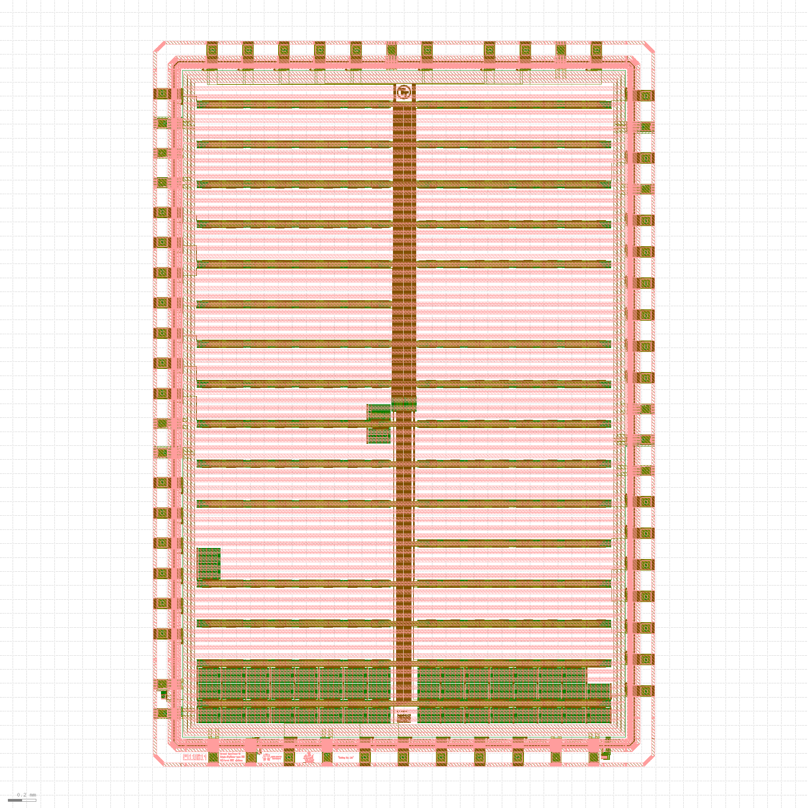

# 🚀 ChipFoundry Tapeout Report

**Consolidated Tapeout and DRC Report**

*Custom Chip Design and Fabrication Platform*

**Generated:** 2025-12-05 20:56:57

## Project Information

| Field | Value |
|-------|-------|
| Project Path | `/mnt/shuttle/ci2511/jdicorpo/nydesign-ci2511` |
| Project Name | **nydesign-ci2511** |
| User | jdicorpo |
| Project ID | 25116d14 |
| Project Type | openframe |
| Slot | 13 |
| Version | 2 |

## Tapeout Status

| Field | Value |
|-------|-------|
| Status | **COMPLETED** |
| Shuttle | ci2511 |
| PDK | sky130A |
| PDK Version | 0fe599b2afb6708d281543108caf8310912f54af |
| PDK Short Hash | 0fe599b2 |
| PDK Tag | current |
| Caravel Version | CC2509 |
| Caravel Commit Hash | a0b50ad1 |
| Target Foundry | skywater |
| Run Tapeout Version | 1.0.0 |
| KLayout Version | ERROR: Unknown option: --version |
| Magic Version | 8.3.471 |
| DRC Input File | `gds/caravel_25116d14.gds` |
| DRC Top Cell | `caravel_25116d14` |
| OAS Output File | `tapeout/outputs/oas/caravel_25116d14.oas` |

## GPIO Configuration

This section shows the GPIO configuration for your project based on layout analysis and RTL definitions.

**Note:** GPIO 0-4 have fixed configurations and are not user-configurable. GPIO 5-37 can be configured to either user or management areas.

*No GPIO configuration data available at this time.*

#### User Wrapper GDS

| Property | Value |
|----------|-------|
| File | `openframe_project_wrapper.gds` |
| Size | 42.22 MB |
| Modified | 2025-12-05T00:09:53.438000 |
| Stored Hash | `2c4f95bbe57732c969f5e7044bd15f28a586ac4bf879fd6ba1f0445f85be3f11` |
| Current Hash | `2c4f95bbe57732c969f5e7044bd15f28a586ac4bf879fd6ba1f0445f85be3f11` |
| Hash Valid | ✅ |

#### OASIS File

| Property | Value |
|----------|-------|
| File | `caravel_25116d14.oas` |
| Size | 21.00 MB |
| Modified | 2025-12-05T01:24:24.260000 |
| Current Hash | `b061db65865b1b91dbcfdf3fd7baa53c16df153262d42dd07d694ac57b328f2f` |
| Stored Hash | `b061db65865b1b91dbcfdf3fd7baa53c16df153262d42dd07d694ac57b328f2f` |
| Hash Valid | ✅ |

#### OASIS Layout Images

Generated layout images from OASIS files showing the chip design visualization.

**caravel_layout**

| Property | Value |
|----------|-------|
| File | `caravel_layout.png` |
| Size | 0.26 MB |
| Modified | 2025-12-05 20:56:50 |
| Format | PNG |

*Images are generated from OASIS files using GDSFactory for high-quality visualization.*

## DRC Results Summary

| Metric | Value |
|--------|-------|
| Total Checks | **29** |
| Passed | 26 |
| Failed | 3 |
| Total Errors | 0 |
| Total Execution Time | 54.01 minutes |
| Last Updated | 2025-12-05T02:18:30.555564 |

## Information Checks

These checks provide information about design features:

| Check Name | Status | Execution Time | Last Updated | Report File |
|------------|--------|----------------|--------------|-------------|
| ChipFoundry SRAM (`cs`) | ⚫ NO | 0.18 min | 2025-12-05T02:18:30.555520 | `../outputs/klayout_CF_SRAM_check.xml` |
| RRAM Layers (`rr`) | ⚫ NO | 0.18 min | 2025-12-05T02:18:30.555541 | `../outputs/klayout_rram_layers_check.xml` |
| OpenRAM (`os`) | ⚫ NO | 0.18 min | 2025-12-05T02:18:30.555543 | `../outputs/klayout_open_sram_check.xml` |

## DRC Validation Checks

These checks validate design rules and constraints:

| Check Name | Status | Errors | Execution Time | Last Updated | Report File |
|------------|--------|--------|----------------|--------------|-------------|
| Metal Global Density (`md`) | ✅ PASS | 0 | 14.20 min | 2025-12-05T02:18:30.555493 | `../outputs/klayout_mgld_check.xml` |
| Backend (`be`) | ✅ PASS | 0 | 9.43 min | 2025-12-05T02:18:30.555559 | `../outputs/klayout_beol_check.xml` |
| Frontend (`fe`) | ✅ PASS | 0 | 7.38 min | 2025-12-05T02:18:30.555564 | `../outputs/klayout_feol_check.xml` |
| Unknown Layers (`ul`) | ✅ PASS | 0 | 6.88 min | 2025-12-05T02:18:30.555531 | `../outputs/klayout_unknown_layers_check.xml` |
| Metal 1 Drawn vs Fill (`m1`) | ✅ PASS | 0 | 3.04 min | 2025-12-05T02:18:30.555499 | `../outputs/klayout_metal1_drawn_vs_fill_check.xml` |
| Metal Tiled Density (`mt`) | ✅ PASS | 0 | 2.65 min | 2025-12-05T02:18:30.555496 | `../outputs/klayout_metd_check.xml` |
| Metal 2 Drawn vs Fill (`m2`) | ✅ PASS | 0 | 2.34 min | 2025-12-05T02:18:30.555501 | `../outputs/klayout_metal2_drawn_vs_fill_check.xml` |
| Metal 3 Drawn vs Fill (`m3`) | ✅ PASS | 0 | 1.46 min | 2025-12-05T02:18:30.555504 | `../outputs/klayout_metal3_drawn_vs_fill_check.xml` |
| Off-Grid (`og`) | ✅ PASS | 0 | 1.37 min | 2025-12-05T02:18:30.555513 | `../outputs/klayout_grid_check.xml` |
| Metal 4 Drawn vs Fill (`m4`) | ✅ PASS | 0 | 1.25 min | 2025-12-05T02:18:30.555507 | `../outputs/klayout_metal4_drawn_vs_fill_check.xml` |
| FOM LI Overlap (`fl`) | ✅ PASS | 0 | 0.80 min | 2025-12-05T02:18:30.555510 | `../outputs/klayout_foml_check.xml` |
| Poly Density (`pd`) | ✅ PASS | 0 | 0.43 min | 2025-12-05T02:18:30.555481 | `../outputs/klayout_poly_check.xml` |
| Special Created Layers (`cl`) | ✅ PASS | 0 | 0.33 min | 2025-12-05T02:18:30.555550 | `../outputs/klayout_special_cl_check.xml` |
| Boundary Check (`bc`) | ✅ PASS | 0 | 0.33 min | 2025-12-05T02:18:30.555556 | `../outputs/klayout_boundary_check.xml` |
| FOM2 (2000x2000) (`f2`) | ✅ PASS | 0 | 0.30 min | 2025-12-05T02:18:30.555527 | `../outputs/klayout_fom_density_2000_check.xml` |
| FOM1 (700x700) (`f1`) | ✅ PASS | 0 | 0.29 min | 2025-12-05T02:18:30.555525 | `../outputs/klayout_fom_density_700_check.xml` |
| Missing Cells (`mc`) | ✅ PASS | 0 | 0.25 min | 2025-12-05T02:18:30.555529 | `../outputs/klayout_missing_cells_check.xml` |
| Spike Check (`sp`) | ✅ PASS | 0 | 0.19 min | 2025-12-05T02:18:30.555517 | `../outputs/klayout_spike_check.xml` |
| is (`is`) | ✅ PASS | 0 | 0.19 min | 2025-12-05T02:18:30.555522 | `../outputs/klayout_IFX_SRAM_check.xml` |
| id (`id`) | ❌ FAIL | 0 | 0.19 min | 2025-12-05T02:18:30.555546 | `../outputs/klayout_id_check.xml` |
| Illegal Character (`ic`) | ✅ PASS | 0 | 0.18 min | 2025-12-05T02:18:30.555538 | `../outputs/klayout_illegal_char_check.xml` |
| Big FOM Density Delta (`bd`) | ✅ PASS | 0 | 0.00 min | 2025-12-05T02:18:30.555534 | No report |
| Little FOM Density Delta (`ld`) | ✅ PASS | 0 | 0.00 min | 2025-12-05T02:18:30.555536 | No report |
| GPIO Check (`gp`) | ✅ PASS | 0 | 0.00 min | 2025-12-05T02:18:30.555548 | No report |
| User Project (`up`) | ❌ FAIL | 0 | 0.00 min | 2025-12-05T02:18:30.555553 | No report |
| Final Status (`fn`) | ❌ FAIL | 0 | 0.00 min | 2025-12-05T02:18:30.555555 | No report |

---

## 🏢 About ChipFoundry

**ChipFoundry** is a leading platform for advanced chip design and verification, providing comprehensive tools and services for the semiconductor industry.

### 🌐 Resources
- **Website:** [https://chipfoundry.io](https://chipfoundry.io)
- **Documentation:** [https://chipfoundry.io/docs](https://chipfoundry.io/docs)
- **Support:** [https://chipfoundry.io/support](https://chipfoundry.io/support)

---
*Report generated by ChipFoundry Tapeout Tools on 2025-12-05 20:56:57*